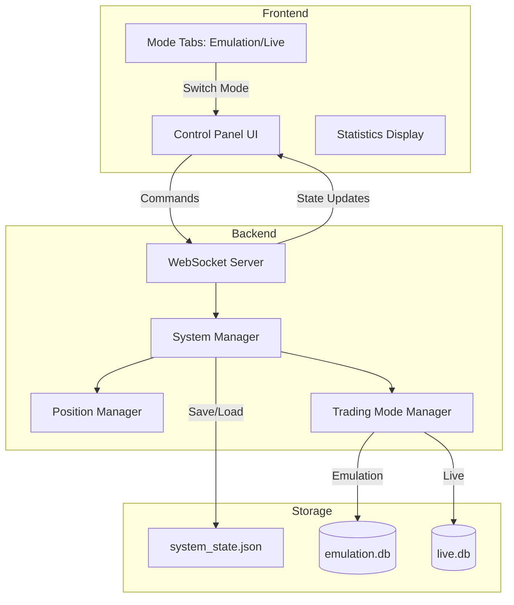
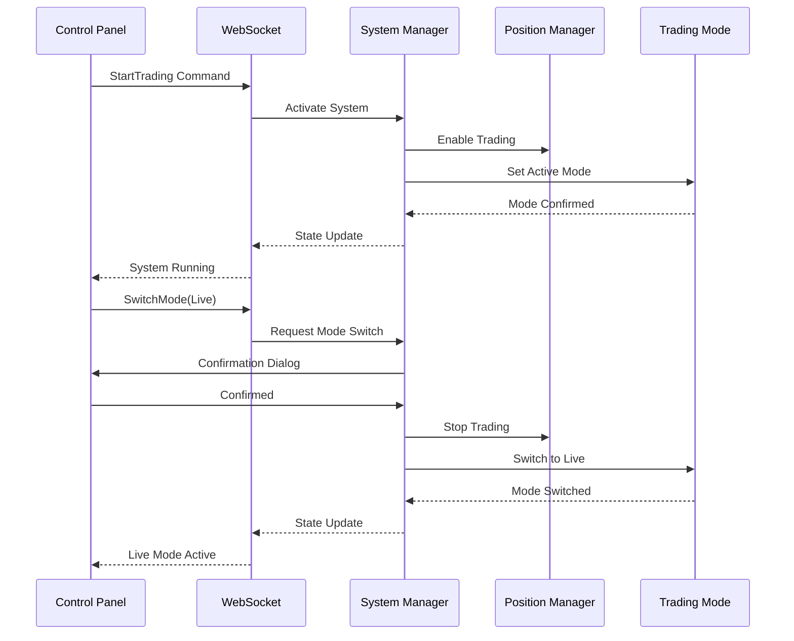

# Design Document: System Control and Trading Modes

## Overview

Данный документ описывает проектирование системы управления торговым ботом с возможностью запуска/остановки и переключения между режимами эмуляции и live торговли. Система обеспечивает безопасное управление торговыми операциями через UI, сохранение состояния между перезапусками и четкое разделение данных между режимами.

## Architecture

### High-Level Architecture



### Component Interaction Flow



## Components and Interfaces

### 1. System Manager (Backend - Rust)

Центральный компонент управления состоянием системы.

```rust
pub struct SystemManager {
    is_running: Arc<RwLock<bool>>,
    current_mode: Arc<RwLock<TradingMode>>,
    state_file_path: PathBuf,
    position_manager: Arc<PositionManager>,
}

#[derive(Debug, Clone, Serialize, Deserialize)]
pub enum TradingMode {
    Emulation,
    Live,
}

#[derive(Debug, Serialize, Deserialize)]
pub struct SystemState {
    pub is_running: bool,
    pub mode: TradingMode,
    pub last_updated: i64,
}

impl SystemManager {
    pub fn new(position_manager: Arc<PositionManager>) -> Self;
    pub async fn start_trading(&self) -> Result<()>;
    pub async fn stop_trading(&self) -> Result<()>;
    pub async fn switch_mode(&self, mode: TradingMode) -> Result<()>;
    pub async fn get_state(&self) -> SystemState;
    pub async fn load_state(&self) -> Result<SystemState>;
    pub async fn save_state(&self) -> Result<()>;
    pub async fn update_settings(&self, settings: TradingSettings) -> Result<()>;
    pub async fn get_settings(&self) -> TradingSettings;
}
```

**Responsibilities:**
- Управление состоянием running/stopped
- Переключение между режимами emulation/live
- Сохранение и загрузка состояния из файла
- Координация с Position Manager

### 2. Trading Mode Manager (Backend - Rust)

Управляет режимами торговли и разделением данных.

```rust
pub struct TradingModeManager {
    current_mode: Arc<RwLock<TradingMode>>,
    emulation_db: Arc<TradingHistory>,
    live_db: Arc<TradingHistory>,
}

impl TradingModeManager {
    pub fn new() -> Self;
    pub async fn set_mode(&self, mode: TradingMode);
    pub async fn get_current_mode(&self) -> TradingMode;
    pub async fn get_stats(&self, mode: TradingMode) -> Option<TradingStats>;
    pub async fn get_trades(&self, mode: TradingMode, limit: i64) -> Vec<TradeRecord>;
    pub async fn record_trade(&self, trade: TradeRecord);
}
```

**Responsibilities:**
- Управление текущим режимом торговли
- Разделение данных между режимами (отдельные БД)
- Запись сделок в соответствующую БД
- Предоставление статистики по режимам

### 3. Enhanced Position Manager (Backend - Rust)

Расширенный Position Manager с поддержкой режимов.

```rust
impl PositionManager {
    // Новые методы
    pub async fn set_trading_enabled(&self, enabled: bool);
    pub async fn is_trading_enabled(&self) -> bool;
    pub async fn set_execution_mode(&self, mode: TradingMode);
    pub async fn get_execution_mode(&self) -> TradingMode;
    
    // Модифицированный метод
    pub async fn process_market_state(&self, state: &PriceState) {
        // Проверка is_trading_enabled перед обработкой сигналов
        if !self.is_trading_enabled().await {
            return;
        }
        
        // Существующая логика...
        
        // При открытии позиции - проверка режима
        let mode = self.get_execution_mode().await;
        match mode {
            TradingMode::Emulation => {
                // Только логирование, без реальных ордеров
            }
            TradingMode::Live => {
                // Отправка реальных ордеров на биржу
                // self.execute_real_order(...).await?;
            }
        }
    }
}
```

**Responsibilities:**
- Проверка флага trading_enabled перед обработкой сигналов
- Выполнение логики в зависимости от режима (emulation/live)
- Интеграция с Trading Mode Manager для записи сделок

### 4. Control Panel Component (Frontend - Angular)

UI компонент для управления системой.

```typescript
interface SystemControlState {
  isRunning: boolean;
  currentMode: 'emulation' | 'live';
  lastUpdated: number;
}

@Component({
  selector: 'app-control-panel',
  template: `
    <div class="control-panel">
      <!-- Start/Stop Controls -->
      <div class="control-buttons">
        <button (click)="toggleTrading()" 
                [class.running]="isRunning()">
          {{ isRunning() ? 'Stop Trading' : 'Start Trading' }}
        </button>
      </div>
      
      <!-- Mode Tabs -->
      <div class="mode-tabs">
        <button (click)="switchMode('emulation')"
                [class.active]="currentMode() === 'emulation'">
          Emulation
        </button>
        <button (click)="switchMode('live')"
                [class.active]="currentMode() === 'live'"
                class="live-mode-btn">
          Live Trading
        </button>
      </div>
      
      <!-- Status Display -->
      <div class="status-display">
        <span class="status-indicator" 
              [class.running]="isRunning()">
        </span>
        <span>{{ statusText() }}</span>
      </div>
    </div>
  `
})
export class ControlPanelComponent {
  isRunning = signal(false);
  currentMode = signal<'emulation' | 'live'>('emulation');
  
  toggleTrading(): void;
  switchMode(mode: 'emulation' | 'live'): void;
  private showConfirmation(message: string): Promise<boolean>;
}
```

**Responsibilities:**
- Отображение текущего состояния системы
- Кнопки управления (Start/Stop)
- Переключение режимов с подтверждением
- Визуальная индикация состояния

### 5. Mode Tabs Component (Frontend - Angular)

Компонент для отображения данных по режимам.

```typescript
@Component({
  selector: 'app-mode-tabs',
  template: `
    <div class="tabs-container">
      <div class="tab-headers">
        <button [class.active]="activeTab() === 'emulation'"
                (click)="setActiveTab('emulation')">
          Emulation
        </button>
        <button [class.active]="activeTab() === 'live'"
                (click)="setActiveTab('live')">
          Live Trading
        </button>
      </div>
      
      <div class="tab-content">
        @if (activeTab() === 'emulation') {
          <app-trading-stats [mode]="'emulation'"></app-trading-stats>
          <app-history-table [mode]="'emulation'"></app-history-table>
        } @else {
          <app-trading-stats [mode]="'live'"></app-trading-stats>
          <app-history-table [mode]="'live'"></app-history-table>
        }
      </div>
    </div>
  `
})
export class ModeTabsComponent {
  activeTab = signal<'emulation' | 'live'>('emulation');
  
  setActiveTab(tab: 'emulation' | 'live'): void;
}
```

**Responsibilities:**
- Переключение между вкладками
- Отображение данных для выбранного режима
- Визуальное разделение режимов

### 6. Enhanced Market Data Service (Frontend - Angular)

Расширенный сервис с поддержкой управления системой.

```typescript
interface SystemCommand {
  type: 'startTrading' | 'stopTrading' | 'switchMode';
  mode?: 'emulation' | 'live';
}

interface SystemStateMessage {
  type: 'systemState';
  is_running: boolean;
  current_mode: 'emulation' | 'live';
  last_updated: number;
}

@Injectable({
  providedIn: 'root'
})
export class MarketDataService {
  private systemStateSubject = new Subject<SystemControlState>();
  public systemState = toSignal(this.systemStateSubject, {
    initialValue: {
      isRunning: false,
      currentMode: 'emulation',
      lastUpdated: 0
    }
  });
  
  startTrading(): void {
    this.sendCommand({ type: 'startTrading' });
  }
  
  stopTrading(): void {
    this.sendCommand({ type: 'stopTrading' });
  }
  
  switchMode(mode: 'emulation' | 'live'): void {
    this.sendCommand({ type: 'switchMode', mode });
  }
  
  private sendCommand(command: SystemCommand): void {
    if (this.ws && this.ws.readyState === WebSocket.OPEN) {
      this.ws.send(JSON.stringify(command));
    }
  }
}
```

**Responsibilities:**
- Отправка команд управления на бэкенд
- Получение обновлений состояния системы
- Управление подписками на данные по режимам

## Data Models

### System State (Persistent Storage)

```json
{
  "is_running": false,
  "mode": "emulation",
  "last_updated": 1709740800000,
  "trading_settings": {
    "capital": 100,
    "position_size_percent": 10,
    "leverage": 200,
    "max_positions": 2,
    "momentum_threshold": 0.03,
    "quick_exit_timeout": 2000,
    "take_profit_percent": 0.04,
    "stop_loss_percent": 0.02,
    "momentum_weight": 0.6,
    "lag_weight": 0.3,
    "price_diff_weight": 0.1
  }
}
```

**Storage Location:** `.kiro/system_state.json`

**Default Values:**
- `is_running`: false (безопасное значение)
- `mode`: "emulation" (безопасное значение)
- `last_updated`: текущая временная метка
- `trading_settings`: настройки торговли по умолчанию

**Persistence Requirements:**
- Все изменения настроек должны немедленно сохраняться в файл
- При загрузке страницы настройки должны восстанавливаться из файла
- При изменении настроек через UI они должны синхронизироваться с бэкендом и сохраняться
- Если файл отсутствует или поврежден, использовать значения по умолчанию

### Trading Database Schema

Две отдельные базы данных SQLite:
- `emulation.db` - для режима эмуляции
- `live.db` - для режима live торговли

Обе используют одинаковую схему (существующая `trading_history.db`):

```sql
CREATE TABLE trades (
    id INTEGER PRIMARY KEY AUTOINCREMENT,
    position_id TEXT NOT NULL,
    side TEXT NOT NULL,
    entry_price REAL NOT NULL,
    exit_price REAL NOT NULL,
    quantity REAL NOT NULL,
    entry_time INTEGER NOT NULL,
    exit_time INTEGER NOT NULL,
    pnl REAL NOT NULL,
    pnl_percent REAL NOT NULL,
    status TEXT NOT NULL,
    initial_impulse REAL NOT NULL
);
```

### WebSocket Message Protocol

#### Client → Server Commands

```typescript
// Команда запуска торговли
{
  "type": "startTrading"
}

// Команда остановки торговли
{
  "type": "stopTrading"
}

// Команда переключения режима
{
  "type": "switchMode",
  "mode": "emulation" | "live"
}

// Запрос состояния системы
{
  "type": "getSystemState"
}

// Запрос настроек
{
  "type": "getSettings"
}

// Обновление настроек (уже существует, но будет сохраняться)
{
  "type": "updateSettings",
  "settings": { ... }
}

{
  "type": "updateCapital",
  "capital": number,
  "position_size_percent": number,
  "leverage": number,
  "max_positions": number
}
```

#### Server → Client Messages

```typescript
// Обновление состояния системы
{
  "type": "systemState",
  "is_running": boolean,
  "current_mode": "emulation" | "live",
  "last_updated": number,
  "trading_settings": {
    "capital": number,
    "position_size_percent": number,
    "leverage": number,
    "max_positions": number,
    "momentum_threshold": number,
    "quick_exit_timeout": number,
    "take_profit_percent": number,
    "stop_loss_percent": number,
    "momentum_weight": number,
    "lag_weight": number,
    "price_diff_weight": number
  }
}

// Запрос подтверждения
{
  "type": "confirmationRequired",
  "action": "switchToLive",
  "message": "Are you sure you want to switch to LIVE trading?"
}

// Ошибка
{
  "type": "error",
  "message": string
}
```

## Error Handling

### Backend Error Scenarios

1. **Файл состояния поврежден**
   - Действие: Создать новый файл с безопасными значениями по умолчанию
   - Логирование: WARNING уровень

2. **Невозможно сохранить состояние**
   - Действие: Продолжить работу, повторить попытку через 5 секунд
   - Логирование: ERROR уровень

3. **Переключение режима при активной торговле**
   - Действие: Отклонить запрос, вернуть ошибку клиенту
   - Сообщение: "Stop trading before switching modes"

4. **База данных недоступна**
   - Действие: Использовать in-memory хранилище, попытаться переподключиться
   - Логирование: ERROR уровень

### Frontend Error Scenarios

1. **WebSocket отключен при отправке команды**
   - Действие: Показать уведомление "Connection lost, reconnecting..."
   - UI: Заблокировать кнопки управления до восстановления

2. **Отказ в переключении режима**
   - Действие: Показать сообщение об ошибке от сервера
   - UI: Вернуть UI в предыдущее состояние

3. **Timeout при ожидании подтверждения**
   - Действие: Отменить операцию через 30 секунд
   - UI: Закрыть диалог подтверждения

## Testing Strategy

### Unit Tests

**Backend (Rust):**
1. `SystemManager::start_trading()` - проверка изменения состояния
2. `SystemManager::stop_trading()` - проверка остановки
3. `SystemManager::switch_mode()` - проверка переключения режимов
4. `SystemManager::save_state()` / `load_state()` - проверка сериализации
5. `TradingModeManager::record_trade()` - проверка записи в правильную БД
6. `PositionManager::process_market_state()` - проверка игнорирования сигналов при stopped

**Frontend (Angular):**
1. `ControlPanelComponent.toggleTrading()` - проверка отправки команд
2. `ControlPanelComponent.switchMode()` - проверка диалога подтверждения
3. `ModeTabsComponent.setActiveTab()` - проверка переключения вкладок
4. `MarketDataService.sendCommand()` - проверка формирования команд

### Integration Tests

1. **Полный цикл Start → Stop**
   - Запустить систему через UI
   - Проверить что Position Manager активен
   - Остановить систему
   - Проверить что новые позиции не открываются

2. **Переключение режимов**
   - Переключить из Emulation в Live
   - Проверить что данные разделены
   - Проверить что статистика отображается корректно

3. **Сохранение состояния**
   - Изменить состояние системы
   - Изменить настройки торговли
   - Перезапустить бэкенд
   - Проверить что состояние и настройки восстановлены
   - Обновить страницу фронтенда
   - Проверить что настройки отображаются корректно

4. **Обработка отрицательных лагов**
   - Симулировать данные с отрицательным лагом
   - Проверить корректное отображение
   - Проверить что торговая логика использует abs(lag)

### Manual Testing Checklist

- [ ] Кнопка Start/Stop корректно меняет состояние
- [ ] Визуальная индикация состояния работает
- [ ] Диалог подтверждения появляется при переключении в Live
- [ ] Вкладки Emulation/Live показывают разные данные
- [ ] Состояние сохраняется между перезапусками
- [ ] Настройки торговли сохраняются между перезапусками
- [ ] Настройки восстанавливаются при обновлении страницы
- [ ] Изменение настроек через UI сохраняется на бэкенде
- [ ] Отрицательные лаги отображаются корректно
- [ ] Система не открывает позиции в состоянии Stopped
- [ ] Режим Emulation не отправляет реальные ордера

## Security Considerations

1. **Защита от случайного переключения в Live**
   - Обязательное модальное окно подтверждения
   - Требование остановки торговли перед переключением
   - Логирование всех переключений режимов

2. **Валидация команд**
   - Проверка типа команды на бэкенде
   - Ограничение частоты команд (rate limiting)
   - Игнорирование неизвестных команд

3. **Безопасные значения по умолчанию**
   - Система запускается в режиме Emulation
   - Торговля по умолчанию остановлена
   - При ошибке загрузки состояния - использовать безопасные значения

4. **Защита файла состояния**
   - Права доступа только для владельца (0600)
   - Атомарная запись (write to temp + rename)
   - Валидация JSON при загрузке

## Performance Considerations

1. **Минимизация блокировок**
   - Использование `Arc<RwLock<>>` для состояния
   - Быстрое чтение состояния без долгих операций под lock

2. **Throttling WebSocket сообщений**
   - Отправка обновлений состояния не чаще 1 раза в секунду
   - Объединение обновлений состояния с обновлениями цен

3. **Оптимизация записи в БД**
   - Batch insert для множественных сделок
   - Асинхронная запись без блокировки основного потока

4. **Кэширование состояния**
   - Кэширование загруженного состояния в памяти
   - Запись в файл только при изменении

## Migration Strategy

### Phase 1: Backend Infrastructure
1. Создать `SystemManager` и `TradingModeManager`
2. Добавить методы управления в `PositionManager`
3. Создать отдельные БД для режимов
4. Реализовать сохранение/загрузку состояния

### Phase 2: WebSocket Protocol
1. Расширить протокол WebSocket новыми командами
2. Добавить обработчики команд в `handle_socket`
3. Реализовать отправку обновлений состояния

### Phase 3: Frontend UI
1. Создать `ControlPanelComponent`
2. Создать `ModeTabsComponent`
3. Расширить `MarketDataService`
4. Интегрировать компоненты в `AppComponent`

### Phase 4: Testing & Refinement
1. Написать unit тесты
2. Провести integration тесты
3. Manual testing
4. Исправление багов и оптимизация

## Open Questions

1. **Нужно ли автоматически останавливать торговлю при переключении режима?**
   - Решение: Да, для безопасности требовать остановки перед переключением

2. **Как обрабатывать открытые позиции при переключении режима?**
   - Решение: Позиции остаются открытыми, но новые не открываются до подтверждения

3. **Нужно ли отдельное API для реальных ордеров в Live режиме?**
   - Решение: Да, будет реализовано в отдельной спецификации (Exchange Order Execution)

4. **Как визуально различать режимы в UI?**
   - Решение: Использовать цветовую схему (зеленый для Emulation, красный для Live)
